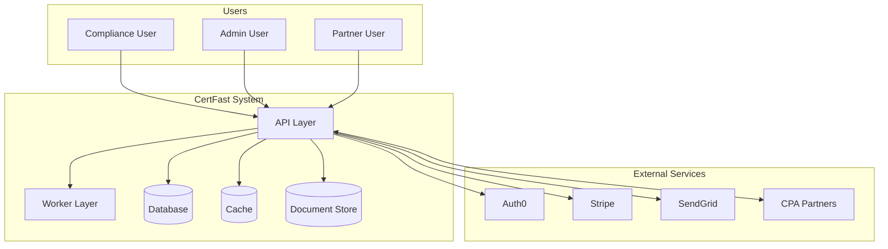

# ⚠️ OBSOLETE — AWS Architecture (Legacy)

> **Status**: ARCHIVED — This document describes the original AWS-based architecture.
> 
> **Decision Date**: 2026-03-15  
> **Current Architecture**: Bare Metal + Docker + Cloudflare R2  
> 
> **See instead**: `/work/certfast/architecture/system-architecture.md` for the current Bare Metal architecture.
> 
> **Reason for change**: Cost control, data sovereignty, operational simplicity

---

# CertFast System Architecture

**Document Version**: 1.0 (ARCHIVED)  
**Date**: March 15, 2026  
**Architect**: System Architect  
**Status**: Draft

---

## Executive Summary

This document defines the technical architecture for CertFast, a compliance automation platform designed to help European startups achieve SOC 2, ISO 27001, and GDPR compliance in 90 days. The architecture supports a four-tier SaaS pricing model, EU data residency requirements, and CPA firm partnership integrations.

### Key Architectural Decisions

| Decision | Choice | Rationale |
|----------|--------|-----------|
| **Cloud Provider** | AWS (eu-west-1) | Market leader, GDPR-compliant EU regions, extensive managed services |
| **Primary Database** | PostgreSQL 16 | ACID compliance, JSON support, mature ecosystem |
| **Application Framework** | Node.js + Express | Fast development, large talent pool, good async performance |
| **Frontend** | React + TypeScript | Type safety, component reusability, strong ecosystem |
| **Container Orchestration** | AWS ECS Fargate | Serverless containers, auto-scaling, no cluster management |
| **Authentication** | Auth0 | SOC 2 compliant, handles MFA, social login, enterprise SSO |

---

## 1. High-Level System Architecture

### 1.1 Architecture Overview

```
┌─────────────────────────────────────────────────────────────────────────────┐
│                              CLIENT LAYER                                    │
├─────────────────────────────────────────────────────────────────────────────┤
│  ┌─────────────┐  ┌─────────────┐  ┌─────────────┐  ┌─────────────────────┐ │
│  │   Web App   │  │  Partner    │  │   Mobile    │  │   CPA Firm Portal   │ │
│  │  (React)    │  │  APIs       │  │  (Future)   │  │    (React)          │ │
│  └──────┬──────┘  └──────┬──────┘  └──────┬──────┘  └──────────┬──────────┘ │
└─────────┼────────────────┼────────────────┼────────────────────┼────────────┘
          │                │                │                    │
          ▼                ▼                ▼                    ▼
┌─────────────────────────────────────────────────────────────────────────────┐
│                           GATEWAY LAYER                                      │
├─────────────────────────────────────────────────────────────────────────────┤
│  ┌────────────────────────────────────────────────────────────────────────┐ │
│  │                      AWS Application Load Balancer                      │ │
│  │                    (HTTPS termination, path routing)                    │ │
│  └────────────────────────────────┬───────────────────────────────────────┘ │
└───────────────────────────────────┼─────────────────────────────────────────┘
                                    │
                                    ▼
┌─────────────────────────────────────────────────────────────────────────────┐
│                         APPLICATION LAYER                                    │
├─────────────────────────────────────────────────────────────────────────────┤
│  ┌────────────────────────────────────────────────────────────────────────┐ │
│  │                    ECS Fargate Services (Auto-scaling)                  │ │
│  │  ┌───────────────┐ ┌───────────────┐ ┌───────────────┐ ┌─────────────┐ │ │
│  │  │   API Server  │ │  Worker Pool  │ │  Webhook      │ │  Partner    │ │ │
│  │  │   (Node.js)   │ │  (Bull Queue) │ │  Processor    │ │  API Gateway│ │ │
│  │  └───────┬───────┘ └───────┬───────┘ └───────┬───────┘ └──────┬──────┘ │ │
│  │          │                 │                 │                │        │ │
│  │          └─────────────────┴─────────────────┴────────────────┘        │ │
│  │                              │                                         │ │
│  │                              ▼                                         │ │
│  │  ┌─────────────────────────────────────────────────────────────────┐   │ │
│  │  │              ElastiCache Redis (Session, Cache, Queue)           │   │ │
│  │  └─────────────────────────────────────────────────────────────────┘   │ │
│  └────────────────────────────────────────────────────────────────────────┘ │
└─────────────────────────────────────────────────────────────────────────────┘
                                    │
                                    ▼
┌─────────────────────────────────────────────────────────────────────────────┐
│                           DATA LAYER                                         │
├─────────────────────────────────────────────────────────────────────────────┤
│  ┌─────────────────────────┐  ┌───────────────────────────────────────────┐ │
│  │   RDS PostgreSQL 16     │  │           S3 (Document Storage)            │ │
│  │   (Multi-AZ, Encrypted) │  │  ┌─────────────┐ ┌─────────────────────┐  │ │
│  │                         │  │  │   Evidence  │ │   Exports/Reports   │  │ │
│  │  ┌─────────────────┐    │  │  │   Documents │ │   (SOC 2, ISO, GDPR)│  │ │
│  │  │   Read Replica  │    │  │  └─────────────┘ └─────────────────────┘  │ │
│  │  │   (Reporting)   │    │  │                                           │ │
│  │  └─────────────────┘    │  └───────────────────────────────────────────┘ │
│  └─────────────────────────┘                                                │
└─────────────────────────────────────────────────────────────────────────────┘
                                    │
                                    ▼
┌─────────────────────────────────────────────────────────────────────────────┐
│                      INTEGRATION LAYER                                       │
├─────────────────────────────────────────────────────────────────────────────┤
│  ┌─────────────┐  ┌─────────────┐  ┌─────────────┐  ┌─────────────────────┐ │
│  │   Auth0     │  │   Stripe    │  │   SendGrid  │  │   Partner CPA APIs  │ │
│  │ (Identity)  │  │ (Billing)   │  │  (Email)    │  │  (REST/Webhooks)    │ │
│  └─────────────┘  └─────────────┘  └─────────────┘  └─────────────────────┘ │
└─────────────────────────────────────────────────────────────────────────────┘
```

### 1.2 Service Boundaries

| Service | Responsibility | Scaling | Instances (MVP) |
|---------|----------------|---------|-----------------|
| **API Server** | REST API, GraphQL, authentication | Horizontal | 2-4 tasks |
| **Worker Pool** | Background jobs, email, exports | Horizontal | 2-4 tasks |
| **Webhook Processor** | Partner webhooks, event handling | Horizontal | 2 tasks |
| **Partner API Gateway** | CPA firm integration APIs | Horizontal | 2 tasks |

---

## 2. Technology Stack

### 2.1 Core Stack

| Layer | Technology | Version | Purpose |
|-------|------------|---------|---------|
| **Runtime** | Node.js | 20 LTS | Server runtime |
| **Framework** | Express.js | 4.x | Web framework |
| **Language** | TypeScript | 5.x | Type safety |
| **Database** | PostgreSQL | 16 | Primary datastore |
| **Cache** | Redis | 7.x | Sessions, caching, queues |
| **Queue** | Bull (Redis) | 4.x | Job processing |
| **ORM** | Prisma | 5.x | Database access |
| **Frontend** | React | 18 | Web application |
| **UI Library** | TailwindCSS | 3.x | Styling |
| **State** | TanStack Query | 5.x | Server state |

### 2.2 Infrastructure Stack

| Component | Service | Region | Notes |
|-----------|---------|--------|-------|
| **Compute** | AWS ECS Fargate | eu-west-1 | Serverless containers |
| **Database** | AWS RDS PostgreSQL | eu-west-1 | Multi-AZ, encrypted |
| **Cache** | AWS ElastiCache Redis | eu-west-1 | Cluster mode |
| **Storage** | AWS S3 | eu-west-1 | Encrypted at rest |
| **CDN** | AWS CloudFront | Global | Edge caching |
| **DNS** | AWS Route 53 | Global | Health checks |
| **WAF** | AWS WAF | eu-west-1 | DDoS protection |
| **Secrets** | AWS Secrets Manager | eu-west-1 | Rotation enabled |

### 2.3 Third-Party Services

| Service | Provider | Purpose | GDPR Status |
|---------|----------|---------|-------------|
| **Authentication** | Auth0 | Identity, SSO | ✅ DPA signed |
| **Payments** | Stripe | Subscription billing | ✅ DPA signed |
| **Email** | SendGrid | Transactional emails | ✅ DPA signed |
| **Monitoring** | Datadog | APM, logging, metrics | ✅ DPA signed |
| **Error Tracking** | Sentry | Error monitoring | ✅ EU-hosted |

---

## 3. Data Flow Architecture

### 3.1 User Authentication Flow

```
┌─────────┐     ┌─────────────┐     ┌──────────┐     ┌─────────────┐
│  User   │────▶│  Auth0      │────▶│  CertFast│────▶│  Database   │
│         │◀────│  (OAuth2)   │◀────│  API     │◀────│  (User)     │
└─────────┘     └─────────────┘     └──────────┘     └─────────────┘
                                         │
                                         ▼
                                    ┌─────────────┐
                                    │  JWT Token  │
                                    │  (RS256)    │
                                    └─────────────┘
```

**Flow Details**:
1. User authenticates via Auth0 (supports MFA, SSO)
2. Auth0 returns JWT ID token
3. API validates JWT and creates/updates user record
4. Subsequent requests include JWT in Authorization header

### 3.2 Compliance Workflow Flow

```
┌─────────────┐    ┌─────────────┐    ┌─────────────┐    ┌─────────────┐
│  Customer   │───▶│  Framework  │───▶│  Controls   │───▶│  Evidence   │
│  Onboarding │    │  Selection  │    │  Assessment │    │  Upload     │
└─────────────┘    └─────────────┘    └─────────────┘    └──────┬──────┘
                                                                 │
                              ┌──────────────────────────────────┘
                              ▼
┌─────────────┐    ┌─────────────┐    ┌─────────────┐    ┌─────────────┐
│  Partner    │◀───│  Audit      │◀───│  Review     │◀───│  Automated  │
│  Review     │    │  Export     │    │  & Sign-off │    │  Checks     │
└─────────────┘    └─────────────┘    └─────────────┘    └─────────────┘
```

### 3.3 Partner Integration Flow

```
┌─────────────┐         ┌─────────────┐         ┌─────────────┐
│  CPA Firm   │────────▶│  Partner    │────────▶│  CertFast   │
│  System     │◀────────│  API Gateway│◀────────│  Webhooks   │
└─────────────┘         └─────────────┘         └─────────────┘
        │                                              │
        │         ┌─────────────┐                      │
        └────────▶│  OAuth2     │◀─────────────────────┘
                  │  (Client Cred)
                  └─────────────┘
```

---

## 4. Multi-Tenancy Architecture

### 4.1 Tenant Isolation Model

CertFast uses a **shared database, schema-per-tenant** model with row-level security for MVP, migrating to **database-per-tenant** for Enterprise customers.

```
┌─────────────────────────────────────────────────────────────────┐
│                     PostgreSQL Database                         │
├─────────────────────────────────────────────────────────────────┤
│  ┌─────────────────────────────────────────────────────────┐   │
│  │  Schema: tenant_abc123 (Standard/Pro customers)         │   │
│  │  ┌─────────┐ ┌─────────┐ ┌─────────┐ ┌──────────────┐   │   │
│  │  │  users  │ │ controls│ │evidence │ │  audits      │   │   │
│  │  └─────────┘ └─────────┘ └─────────┘ └──────────────┘   │   │
│  └─────────────────────────────────────────────────────────┘   │
│  ┌─────────────────────────────────────────────────────────┐   │
│  │  Schema: tenant_xyz789 (Standard/Pro customers)         │   │
│  │  ┌─────────┐ ┌─────────┐ ┌─────────┐ ┌──────────────┐   │   │
│  │  │  users  │ │ controls│ │evidence │ │  audits      │   │   │
│  │  └─────────┘ └─────────┘ └─────────┘ └──────────────┘   │   │
│  └─────────────────────────────────────────────────────────┘   │
│  ┌─────────────────────────────────────────────────────────┐   │
│  │  Database: enterprise_corp (Enterprise customers)       │   │
│  │  ┌─────────┐ ┌─────────┐ ┌─────────┐ ┌──────────────┐   │   │
│  │  │  users  │ │ controls│ │evidence │ │  audits      │   │   │
│  │  └─────────┘ └─────────┘ └─────────┘ └──────────────┘   │   │
│  └─────────────────────────────────────────────────────────┘   │
└─────────────────────────────────────────────────────────────────┘
```

### 4.2 Tenant Context

All API requests include tenant context via:
- **JWT claim**: `tenant_id` embedded in access token
- **Request header**: `X-Tenant-ID` for partner API calls
- **Database**: `SET search_path TO tenant_schema` per request

---

## 5. Security Architecture

### 5.1 Defense in Depth

```
┌─────────────────────────────────────────────────────────────────┐
│  Layer 1: Perimeter (AWS WAF + CloudFront)                      │
│  - DDoS protection                                              │
│  - SQL injection prevention                                     │
│  - Rate limiting: 100 req/min per IP                            │
├─────────────────────────────────────────────────────────────────┤
│  Layer 2: Network (VPC + Security Groups)                       │
│  - Private subnets for databases                                │
│  - No public IPs on compute                                     │
│  - VPC endpoints for AWS services                               │
├─────────────────────────────────────────────────────────────────┤
│  Layer 3: Application (API Gateway)                             │
│  - JWT validation                                               │
│  - Request size limits (10MB)                                   │
│  - CORS whitelist                                               │
├─────────────────────────────────────────────────────────────────┤
│  Layer 4: Service (Application Code)                            │
│  - Input validation (Zod schemas)                               │
│  - Parameterized queries (Prisma)                               │
│  - Authorization checks on every endpoint                       │
├─────────────────────────────────────────────────────────────────┤
│  Layer 5: Data (Encryption)                                     │
│  - TLS 1.3 in transit                                           │
│  - AES-256 at rest (AWS managed keys)                           │
│  - Column-level encryption for PII                              │
└─────────────────────────────────────────────────────────────────┘
```

### 5.2 Encryption Strategy

| Data State | Method | Key Management |
|------------|--------|----------------|
| **In Transit** | TLS 1.3 | AWS Certificate Manager |
| **At Rest (DB)** | AES-256 | AWS RDS encryption |
| **At Rest (S3)** | AES-256 | AWS S3-SSE |
| **PII Fields** | AES-256-GCM | AWS KMS + envelope encryption |
| **Secrets** | N/A | AWS Secrets Manager |

### 5.3 Access Control Model

**Role-Based Access Control (RBAC)** with tier-based restrictions:

| Role | Description | Tier Availability |
|------|-------------|-------------------|
| **Owner** | Full access, billing management | All |
| **Admin** | User management, configuration | Starter+ |
| **Compliance Manager** | Controls, evidence, audits | All |
| **Auditor** | Read-only access, export reports | Pro+ |
| **Viewer** | Read-only dashboard access | Starter+ |

---

## 6. Scalability & Performance

### 6.1 Capacity Planning

| Metric | MVP (Year 1) | Scale (Year 3) | Growth Factor |
|--------|--------------|----------------|---------------|
| **Customers** | 320 | 1,900 | 6x |
| **Concurrent Users** | 50 | 300 | 6x |
| **API Requests/day** | 50,000 | 500,000 | 10x |
| **Documents Stored** | 50,000 | 1,000,000 | 20x |
| **Data Size** | 100 GB | 2 TB | 20x |

### 6.2 Scaling Strategy

**Horizontal Scaling** (Stateless services):
- ECS auto-scaling: 2-20 tasks based on CPU/memory
- Target: <70% CPU utilization
- Scale-out: +2 tasks when threshold exceeded
- Scale-in: -1 task when below 40% for 5 min

**Vertical Scaling** (Stateful services):
- RDS: db.t3.medium → db.r6g.2xlarge
- Redis: cache.t3.micro → cache.r6g.xlarge
- S3: Unlimited (automatic)

**Read Scaling**:
- RDS Read Replica for reporting queries
- Redis for session and cache
- CloudFront for static assets

### 6.3 Performance Targets

| Metric | Target | Measurement |
|--------|--------|-------------|
| **API Response Time (p95)** | <200ms | Datadog APM |
| **Page Load Time** | <2s | Real User Monitoring |
| **File Upload (10MB)** | <10s | End-to-end test |
| **Report Generation** | <30s | Background job |
| **Uptime SLA** | 99.9% | Datadog Synthetics |

---

## 7. Disaster Recovery & Backup

### 7.1 Backup Strategy

| Component | Frequency | Retention | Method |
|-----------|-----------|-----------|--------|
| **PostgreSQL** | Daily + hourly WAL | 35 days | RDS automated + snapshots |
| **S3 Documents** | Continuous | 7 years | Versioning + cross-region replication |
| **Redis** | Hourly | 7 days | Manual snapshots |
| **Config/Secrets** | On change | 30 versions | AWS Config + Secrets Manager |

### 7.2 Recovery Objectives

| Scenario | RTO (Recovery Time) | RPO (Data Loss) |
|----------|---------------------|-----------------|
| **Single AZ failure** | <5 minutes | 0 (Multi-AZ) |
| **Database corruption** | <30 minutes | <1 hour |
| **Region failure** | <4 hours | <1 hour (cross-region) |
| **Complete disaster** | <24 hours | <1 hour |

### 7.3 Business Continuity

- **Multi-AZ deployment**: Automatic failover
- **Cross-region backup**: S3 replication to eu-central-1
- **Runbook documented**: Step-by-step recovery procedures
- **Quarterly DR drills**: Tested recovery procedures

---

## 8. Monitoring & Observability

### 8.1 Monitoring Stack

| Layer | Tool | Purpose |
|-------|------|---------|
| **APM** | Datadog | Distributed tracing, performance |
| **Logging** | Datadog + CloudWatch | Centralized log aggregation |
| **Metrics** | Datadog + CloudWatch | Infrastructure metrics |
| **Error Tracking** | Sentry | Exception tracking |
| **Uptime** | Datadog Synthetics | Endpoint monitoring |
| **Alerting** | Datadog + PagerDuty | Incident notification |

### 8.2 Key Metrics Dashboard

| Category | Metric | Alert Threshold |
|----------|--------|-----------------|
| **Availability** | Uptime | <99.9% for 5 min |
| **Performance** | API p95 latency | >500ms for 10 min |
| **Error Rate** | 5xx errors | >1% for 5 min |
| **Business** | Failed payments | >10/hour |
| **Security** | Failed logins | >100/min from single IP |
| **Cost** | Daily AWS spend | >150% of baseline |

### 8.3 Alerting Tiers

| Severity | Response Time | Notification |
|----------|---------------|--------------|
| **P1 - Critical** | 15 minutes | Page on-call |
| **P2 - High** | 1 hour | Slack #alerts |
| **P3 - Medium** | 4 hours | Email digest |
| **P4 - Low** | 24 hours | Daily report |

---

## 9. CI/CD Pipeline

### 9.1 Pipeline Architecture

```
┌─────────┐    ┌─────────┐    ┌─────────┐    ┌─────────┐    ┌─────────┐
│  Code   │───▶│  Build  │───▶│  Test   │───▶│  Stage  │───▶│  Prod   │
│  Push   │    │  (Docker│    │  (Jest, │    │  Deploy │    │  Deploy │
│         │    │   Build)│    │   E2E)  │    │         │    │         │
└─────────┘    └─────────┘    └────┬────┘    └─────────┘    └─────────┘
                                   │
                                   ▼
                            ┌─────────────┐
                            │  Security   │
                            │  Scan       │
                            │ (Snyk, Trivy│
                            └─────────────┘
```

### 9.2 Deployment Process

| Stage | Environment | Gates | Auto-deploy |
|-------|-------------|-------|-------------|
| **Build** | CI runner | Lint, Unit tests | Yes |
| **Test** | Integration | E2E tests, Security scan | Yes |
| **Staging** | Staging env | Manual approval | No |
| **Production** | Production | Staging validation | Manual |

### 9.3 Deployment Safety

- **Blue-green deployment**: Zero-downtime releases
- **Feature flags**: LaunchDarkly for gradual rollouts
- **Rollback**: <5 minutes to previous version
- **Database migrations**: Backward compatible, run before deploy

---

## 10. Infrastructure Cost Estimate

### 10.1 Monthly Costs (MVP - Year 1)

| Component | Service | Monthly Cost |
|-----------|---------|--------------|
| **Compute** | ECS Fargate (4 tasks) | €180 |
| **Database** | RDS PostgreSQL (db.t3.medium) | €85 |
| **Cache** | ElastiCache Redis (cache.t3.micro) | €25 |
| **Storage** | S3 (100GB) | €5 |
| **CDN** | CloudFront | €20 |
| **DNS** | Route 53 | €5 |
| **WAF** | AWS WAF | €15 |
| **Secrets** | Secrets Manager | €5 |
| **Monitoring** | Datadog (APM + Logs) | €150 |
| **Third-party** | Auth0, Stripe, SendGrid | €100 |
| **Backup** | Cross-region S3 | €10 |
| **Reserved IP** | Elastic IP | €5 |
| **Total Infrastructure** | | **€605/month** |
| **Total with Third-party** | | **€705/month** |

### 10.2 Monthly Costs (Year 3 - Scale)

| Component | Service | Monthly Cost |
|-----------|---------|--------------|
| **Compute** | ECS Fargate (12 tasks) | €540 |
| **Database** | RDS PostgreSQL (db.r6g.large) + Replica | €450 |
| **Cache** | ElastiCache Redis (cache.r6g.large) | €200 |
| **Storage** | S3 (2TB) | €50 |
| **CDN** | CloudFront (higher traffic) | €80 |
| **DNS** | Route 53 | €10 |
| **WAF** | AWS WAF | €30 |
| **Secrets** | Secrets Manager | €15 |
| **Monitoring** | Datadog (scale) | €400 |
| **Third-party** | Auth0, Stripe, SendGrid | €300 |
| **Backup** | Cross-region S3 | €80 |
| **Reserved IP** | Elastic IP | €5 |
| **Total Infrastructure** | | **€2,160/month** |
| **Total with Third-party** | | **€2,460/month** |

### 10.3 Cost per Customer

| Stage | Monthly Cost | Customers | Cost/Customer |
|-------|--------------|-----------|---------------|
| **Year 1 (MVP)** | €705 | 320 | €2.20 |
| **Year 2 (Growth)** | €1,400 | 900 | €1.56 |
| **Year 3 (Scale)** | €2,460 | 1,900 | €1.29 |

---

## 11. Migration Path

### 11.1 MVP to Scale Roadmap

| Phase | Timeline | Focus | Key Changes |
|-------|----------|-------|-------------|
| **MVP** | Months 1-6 | Core platform | Single-AZ, shared resources |
| **Growth** | Months 7-12 | Reliability | Multi-AZ, read replicas |
| **Scale** | Year 2+ | Performance | Caching layer, CDN optimization |
| **Enterprise** | Year 2+ | Isolation | Dedicated DBs for Enterprise |

### 11.2 Technical Debt Management

- **Monthly reviews**: Architecture decision records
- **Quarterly refactoring**: Dedicated sprints for cleanup
- **Deprecation policy**: 6-month notice for API changes

---

## 12. Key Architectural Decisions (ADRs)

### ADR-001: Cloud Provider Selection
**Decision**: AWS over GCP/Azure  
**Rationale**: Largest talent pool, most mature EU regions, extensive managed services  
**Trade-off**: Slightly higher cost than GCP, vendor lock-in  
**Status**: Accepted

### ADR-002: Multi-Tenancy Model
**Decision**: Schema-per-tenant (MVP), database-per-tenant (Enterprise)  
**Rationale**: Balance isolation with operational simplicity  
**Trade-off**: Less isolation than DB-per-tenant for shared tier  
**Status**: Accepted

### ADR-003: Container Orchestration
**Decision**: ECS Fargate over EKS  
**Rationale**: No cluster management, faster development, sufficient for scale  
**Trade-off**: Less flexibility than Kubernetes  
**Status**: Accepted

### ADR-004: Authentication Provider
**Decision**: Auth0 over Cognito/custom  
**Rationale**: SOC 2 compliant, enterprise SSO ready, faster time-to-market  
**Trade-off**: External dependency, per-user cost  
**Status**: Accepted

---

## 13. Risk Assessment

| Risk | Likelihood | Impact | Mitigation |
|------|------------|--------|------------|
| **AWS region outage** | Low | Critical | Multi-AZ + cross-region backup |
| **Database performance degradation** | Medium | High | Read replicas, connection pooling |
| **Security breach** | Low | Critical | Defense in depth, penetration testing |
| **Third-party service failure** | Medium | Medium | Circuit breakers, fallback modes |
| **Cost overruns** | Medium | Medium | Budget alerts, reserved instances |

---

## 14. Next Steps

1. **Database Schema Design**: Define detailed data model (`database-schema.md`)
2. **API Specification**: Design RESTful APIs (`api-specification.md`)
3. **Security Architecture**: Detailed security controls and compliance mapping
4. **Infrastructure as Code**: Terraform/CloudFormation templates
5. **Development Environment**: Local setup with Docker Compose

---

## Appendix: Architecture Diagrams (Mermaid)

### System Context Diagram



---

**Document Complete**  
**Next**: Database Schema Design
